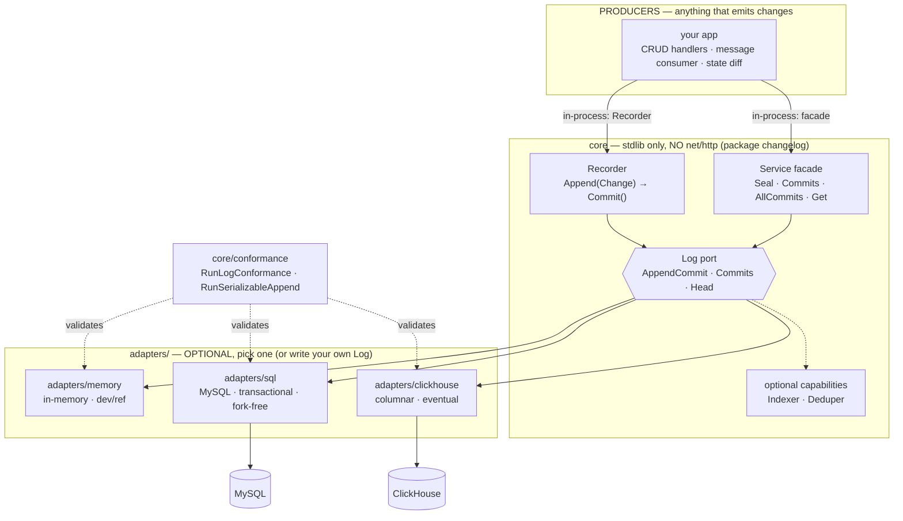

# chronicle

A **durable, database-agnostic changelog (audit-log) library for Go.** Buffer
`Change`s, seal them into git-style hash-chained `Commit`s, and store them behind
a 3-method `Log` port. Pick a backend — in-memory (dev), MySQL (transactional),
ClickHouse (columnar) — or write your own.

Plain Go, organized as independently-versioned modules tied together by a
top-level `go.work`. The **core** is standard-library only; database **adapters**
carry their own driver dependency in their own `go.mod`.

> Source-agnostic: a `Change` can come from anywhere — REST/CRUD handlers, a
> message consumer, a diff of two states. The library never assumes how changes
> are produced; you `Append` them and `Commit`.

**Mental model:** it's intentionally git-shaped — stage edits, seal them into a
content-addressed commit hash-chained to its parent, per-document branches. See
**[the git model](core/MODEL.md)** for a side-by-side with git.

## Status & stability

**v0 — experimental.** The API may change before a v1 tag; pin a specific module
version and check changes before upgrading. Modules are versioned independently
(`core/vX.Y.Z`, `adapters/sql/vX.Y.Z`, …). The storage contract (`Log` + the
conformance suite) is the most stable surface; capability interfaces and adapters
may still evolve.

Running a durable backend in production? See **[OPERATIONS.md](OPERATIONS.md)**
for connection-pool tuning, the ClickHouse `FINAL` cost, migrations, and
backup/restore.

## Architecture — every piece



**Read it as:** something produces `Change`s (your CRUD handlers, a message
consumer, a state diff) → a `Recorder` or the `Service` facade seals them into a
`Commit` → the `Commit` lands in a `Log` backend. **Exposing this over a wire (an
HTTP server + a client SDK) is the consumer's job** — chronicle ships no HTTP; you
write a thin transport over the `Service` facade.

## Modules

| Module (dir) | Import path | Role | Deps |
|---|---|---|---|
| `core` | `…/chronicle/core` | **The core** (package `changelog`): `Log` port, `Recorder`, `Commit`/`Change`, capability interfaces | stdlib |
| `core/conformance` | `…/chronicle/core/conformance` | Conformance suite every `Log` must pass | stdlib |
| `adapters/memory` | `…/chronicle/adapters/memory` | In-memory `Log` — dev / reference (package `changelogmemory`) | stdlib |
| `adapters/sql` | `…/chronicle/adapters/sql` | Durable **MySQL** adapter — transactional, fork-free | `go-sql-driver/mysql` |
| `adapters/clickhouse` | `…/chronicle/adapters/clickhouse` | Durable **ClickHouse** adapter — columnar, eventual | `clickhouse-go/v2` |

(`…` = `github.com/zdirnecamlcs96`.)

**Talking over a wire** (chronicle ships none of it — a Go server often needs none):

- **In-process facade (no wire, no `net/http`):** `changelog.NewService(log)`
  returns a `Service` — seal + reads + producer idempotency + cross-document index
  over any `Log`. Init it once and call it directly; it lives in `core` and has
  **zero http dependency**. A Go server usually stops here.

  ```go
  svc := changelog.NewService(log)        // pick any backend Log
  svc.Seal(ctx, "doc-1", changes, "msg")  // in-process — no handler, no port
  ```

- **Over HTTP / to other languages — you own the transport.** chronicle ships no
  HTTP server and no client SDK; exposing the facade over a wire is a thin layer
  you write — an `http.Handler` (routing + JSON) that calls the `Service`, plus a
  client in your target language that speaks the same routes. The library stays
  out of your transport, auth, and middleware choices.

(For a Go consumer there's no SDK at all — you import `core` directly.)

**Note the import path is `…/core` but the package is `changelog`** — so you write
`changelog.Recorder`, `changelog.Log`, `changelog.Commit`. The `core` dir name
just says "this is the core module."

**Adapters are optional.** The core never imports one. To store, you have two
choices: use a shipped adapter (`memory`/`sql`/`clickhouse`), or **implement `Log`
yourself** (3 methods, zero adapter imports).

## The `Log` port

The whole library hangs off one interface (`core/log.go`):

```go
type Log interface {
    AppendCommit(ctx context.Context, docID string, c Commit) error
    Commits(ctx context.Context, docID string, limit int) ([]Commit, error) // newest-first; limit<=0 = all
    Head(ctx context.Context, docID string) (string, error)                 // current commit id, "" if none
}
```

Two **optional** capability interfaces a backend may also implement
(`core/capability.go`); detect with a type assertion:

```go
type Indexer interface { // cross-document queries
    AllCommits(ctx context.Context, limit int) ([]DocCommit, error)
    FindByID(ctx context.Context, commitID string) (DocCommit, bool, error)
}
type Deduper interface { // producer idempotency
    Seen(ctx context.Context, key string) (Commit, bool, error)
    MarkSeen(ctx context.Context, key, docID string, c Commit) error
}
```

`adapters/sql` and `adapters/clickhouse` implement all three (`Log` + `Indexer`
+ `Deduper`). `adapters/memory` implements **`Log` only** — for cross-document
queries and dedup on the memory backend, the consumer (e.g. the reference
server) falls back to its own in-memory bookkeeping.

## Backends

| Backend | Import (dir) | Consistency | `RunLogConformance` | `RunSerializableAppend` |
|---|---|---|---|---|
| `changelogmemory.New()` | `adapters/memory` | in-memory (lost on restart) | ✅ | — (can fork) |
| `changelogsql.Open(...)` | `adapters/sql` | **transactional** (`FOR UPDATE` + unique constraints) | ✅ | ✅ fork-free |
| `changelogclickhouse.Open(...)` | `adapters/clickhouse` | **eventual** (`ReplacingMergeTree` + `FINAL`) | ✅ | — (no synchronous locks) |

The memory adapter is **reference/test only** — never production. Choose
`adapters/sql` when you need synchronous fork-prevention (one linear chain per
doc under concurrent writers); `adapters/clickhouse` for cheap columnar retention
+ analytical queries where producers serialize per-document.

## Quick start (Go)

```go
import (
    "context"

    "github.com/zdirnecamlcs96/chronicle/core" // package changelog
    changelogmemory "github.com/zdirnecamlcs96/chronicle/adapters/memory"
)

ctx := context.Background()
log := changelogmemory.New() // dev/test — swap for a durable adapter in prod

rec := changelog.NewRecorder("invoice-42", log)
rec.Append(changelog.Change{Actor: "alice", Path: "status", Kind: "put", From: "draft", To: "sent"})
commit, err := rec.Commit(ctx, changelog.WithMessage("send invoice"))
// commit.ID = SHA256(parent + message + canonical(changes)), chained onto Head

history, _ := log.Commits(ctx, "invoice-42", 0) // newest-first
```

Durable — same `Recorder`, just a different `Log`:

```go
import changelogsql "github.com/zdirnecamlcs96/chronicle/adapters/sql"

log, err := changelogsql.Open(ctx,
    "user:pass@tcp(127.0.0.1:3306)/changelog?parseTime=true",
    changelogsql.WithMigrate(true))
defer log.Close()
rec := changelog.NewRecorder("invoice-42", log) // durable now
```

```go
import changelogclickhouse "github.com/zdirnecamlcs96/chronicle/adapters/clickhouse"

log, err := changelogclickhouse.Open(ctx,
    "clickhouse://default:@127.0.0.1:9000/changelog",
    changelogclickhouse.WithMigrate(true))
defer log.Close()
```

## Exposing it over a wire

chronicle is Go-only and ships no HTTP server or client SDK — exposing the facade
is a thin layer you write over `changelog.NewService`. A typical HTTP shape:

- `POST /commits` — seal a batch: `{doc_id, changes[], message?, idempotency_key?}`
- `GET  /commits?doc=&limit=` — a document's commits (or all, omit `doc`)
- `GET  /commits/{id}` — one commit by id
- `GET  /changes?doc=&limit=` — the flattened change feed

Each route maps to a `Service` call; the `Service` owns hashing, parent chaining,
and idempotent dedup (an `idempotency_key` makes at-least-once delivery seal
exactly one commit). Auth, middleware, TLS, and the client side are yours.

## The conformance contract

A new backend is "correct" when it passes the suite — this is what makes the
abstraction trustworthy across databases (and is how you'd validate a `Log` you
write yourself):

```go
import "github.com/zdirnecamlcs96/chronicle/core/conformance"

func TestMyBackend(t *testing.T) {
    conformance.RunLogConformance(t, func(t *testing.T) (changelog.Log, func()) {
        return newMyLog(t), func() { /* teardown */ }
    })
    // transactional backends additionally:
    // conformance.RunSerializableAppend(t, newMyLog)
}
```

`RunLogConformance` (mandatory): empty head/commits, append→head, parent
chaining, newest-first order, limit, per-doc isolation, context cancellation.
`RunSerializableAppend` (opt-in): concurrent same-doc seals form one linear
chain — passes only for transactional backends.

## Writing an adapter

The **core declares the contract**; an adapter follows it (Go has no abstract
base class — the interface *is* the contract, satisfied structurally):

1. Implement `changelog.Log` — mandatory: `AppendCommit` / `Commits` / `Head`.
2. Optionally implement `changelog.Indexer` and/or `changelog.Deduper` for native
   cross-document queries / durable dedup. If you don't, a consumer falls back to
   its own bookkeeping (as a consumer would for the memory adapter).
3. Assert it at compile time: `var _ changelog.Log = (*MyLog)(nil)`.
4. Prove behavior: pass `conformance.RunLogConformance` (and
   `RunSerializableAppend` if your backend serializes same-document appends).

The core never imports your adapter — your adapter imports the core. That's why
adapters are optional and live as sibling modules.

## Using it in your project

```sh
go get github.com/zdirnecamlcs96/chronicle/core@latest
# add an adapter only if you import one (you don't have to):
go get github.com/zdirnecamlcs96/chronicle/adapters/sql@latest
```

Each module is versioned independently with Go subdirectory tags
(`core/vX.Y.Z`, `adapters/sql/vX.Y.Z`, …); an adapter requires a tagged `core`.

## Repo commands

```sh
# go.work spans all modules; the repo root is not itself a module
go test ./core/... ./adapters/memory/... ./adapters/sql/... ./adapters/clickhouse/...
go build ./core/... ./adapters/...

# adapter integration tests (real MySQL + ClickHouse) are build-tagged:
#   CHANGELOG_SQL_TEST_DSN=… go test -tags integration ./adapters/sql/...
```

## Status

Pre-release. The core + memory adapter are standard-library only. `adapters/sql`
+ `adapters/clickhouse` are integration-tested against real MySQL + ClickHouse.
The memory adapter is reference/test only.
