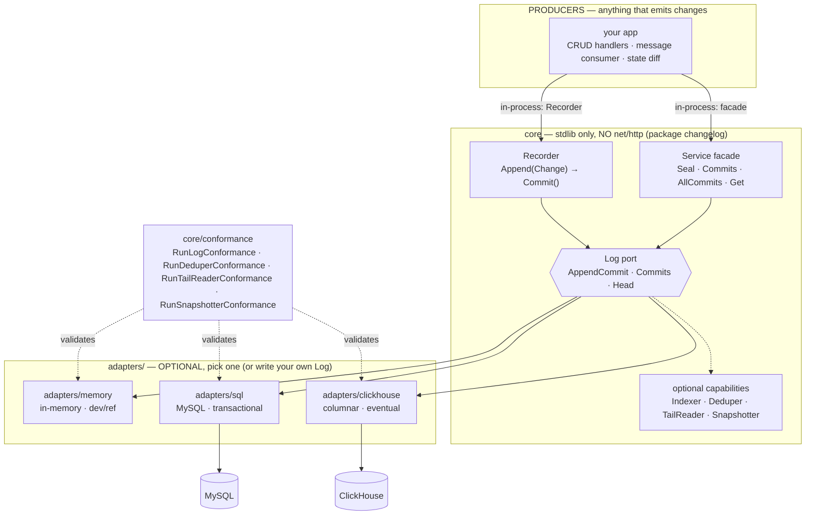

# chronicle

A **durable, database-agnostic changelog (audit-log) library for Go.** Buffer
`Change`s, seal them into git-style hash-chained `Commit`s, and store them behind
a 3-method `Log` port. Pick a backend — in-memory (dev), MySQL (transactional),
ClickHouse (columnar) — or write your own.

Plain Go, organized as independently-versioned modules tied together by a
top-level `go.work`. The **core** is standard-library only; database **adapters**
carry their own driver dependency in their own `go.mod`.

> Source-agnostic: a `Change` can come from anywhere — REST/CRUD handlers, a
> message consumer, a diff of two states. The library never assumes how changes
> are produced; you `Append` them and `Commit`. That includes **collaboratively
> edited documents**: chronicle implements no CRDT, but because `Changes` is an
> ordered list of operations rather than a snapshot, replaying it converges
> last-write-wins while every actor's operation — including the ones that lost —
> stays on the record. See
> [where changes come from](https://zdirnecamlcs96.github.io/chronicle/documentation/kit/#where-changes-come-from).

**Mental model:** it's intentionally git-shaped — stage edits, seal them into a
content-addressed commit hash-chained to its parent, per-document branches. See
**[the git model](docs/model.md)** for a side-by-side with git, and
**[CONCEPTS.md](docs/concepts.md)** for the patterns and algorithms underneath (hash
chain, event sourcing, snapshotting, anchor verification, …).

## Status & stability

**v0 — experimental.** The API may change before a v1 tag; pin a specific module
version and check changes before upgrading. Modules are versioned independently
(`core/vX.Y.Z`, `adapters/sql/vX.Y.Z`, …). The storage contract (`Log` + the
conformance suite) is the most stable surface; capability interfaces and adapters
may still evolve.

Running a durable backend in production? See **[OPERATIONS.md](docs/operations.md)**
for connection-pool tuning, the ClickHouse `FINAL` cost, migrations, and
backup/restore.

## Architecture — every piece


```mermaid
flowchart TB
    subgraph L1["PRODUCERS — anything that emits changes"]
        APP["your app<br/>CRUD handlers · message consumer · state diff"]
    end

    subgraph L2["core — stdlib only, NO net/http (package changelog)"]
        REC["Recorder<br/>Append(Change) → Commit()"]
        SVC["Service facade<br/>Seal · Commits · AllCommits · Get"]
        PORT{{"Log port<br/>AppendCommit · Commits · Head"}}
        CAP["optional capabilities<br/>Indexer · Deduper · TailReader · Snapshotter"]
        REC --> PORT
        SVC --> PORT
        PORT -.-> CAP
    end

    subgraph L3["adapters/ — OPTIONAL, pick one (or write your own Log)"]
        MEM["adapters/memory<br/>in-memory · dev/ref"]
        SQL["adapters/sql<br/>MySQL · transactional"]
        CH["adapters/clickhouse<br/>columnar · eventual"]
    end

    DBA[("MySQL")]
    DBB[("ClickHouse")]
    CONF["core/conformance<br/>RunLogConformance · RunDeduperConformance · RunTailReaderConformance · RunSnapshotterConformance"]

    APP -->|in-process: Recorder| REC
    APP -->|in-process: facade| SVC
    PORT --> MEM
    PORT --> SQL
    PORT --> CH
    SQL --> DBA
    CH --> DBB
    CONF -. validates .-> MEM
    CONF -. validates .-> SQL
    CONF -. validates .-> CH
```

**Read it as:** something produces `Change`s (your CRUD handlers, a message
consumer, a state diff) → a `Recorder` or the `Service` facade seals them into a
`Commit` → the `Commit` lands in a `Log` backend. **The core ships no HTTP** — it
imports nothing beyond the standard library. Exposing this over a wire is a thin
transport over the `Service` facade, and the optional `kit/httpapi` package ships
one you can mount directly or read as a worked example.

## Modules

| Module (dir) | Import path | Role | Deps |
|---|---|---|---|
| `core` | `…/chronicle/core` | **The core** (package `changelog`): `Log` port, `Recorder`, `Commit`/`Change`, capability interfaces | stdlib |
| `core/conformance` | `…/chronicle/core/conformance` | Conformance suite every `Log` must pass | stdlib |
| `kit` | `…/chronicle/kit` | One-stop facade (package `chroniclekit`): `RecordUpdate`/`RecordChanges`/`RecordPatch` sealing, delegating reads, JSON Patch interop | stdlib |
| `kit/schema` | `…/chronicle/kit/schema` | The declared vocabulary (package `chronicleschema`): the `Option`s you set, plus the change kinds. Path grammar and `Apply` are internal machinery, not caller vocabulary | stdlib |
| `kit/diff` | `…/chronicle/kit/diff` | `Diff` — before/after → `Change`s (package `chroniclediff`) | stdlib |
| `kit/view` | `…/chronicle/kit/view` | Replay reads (package `chronicleview`): `Reconstruct`, `State`/`StateAt`, snapshots | stdlib |
| `kit/explain` | `…/chronicle/kit/explain` | `Explain` — read-time display decoration (package `chronicleexplain`) | stdlib |
| `kit/httpapi` | `…/chronicle/kit/httpapi` | Optional stdlib `http.Handler` over a `Service` | stdlib |
| `adapters/memory` | `…/chronicle/adapters/memory` | In-memory `Log` — dev / reference (package `changelogmemory`) | stdlib |
| `adapters/sql` | `…/chronicle/adapters/sql` | Durable **MySQL** adapter — transactional | `go-sql-driver/mysql` |
| `adapters/clickhouse` | `…/chronicle/adapters/clickhouse` | Durable **ClickHouse** adapter — columnar, eventual | `clickhouse-go/v2` |

(`…` = `github.com/zdirnecamlcs96`.)

**Talking over a wire** (the core ships none of it — a Go server often needs none):

- **In-process facade (no wire, no `net/http`):** `changelog.NewService(log)`
  returns a `Service` — seal + reads, plus producer idempotency and cross-document
  index when the backend implements `Deduper`/`Indexer` (the shipped adapters all
  do). Init it once and call it directly; it lives in `core` and has **zero http
  dependency**. A Go server usually stops here.

  ```go
  svc := changelog.NewService(log)        // pick any backend Log
  svc.Seal(ctx, "doc-1", changes, "msg")  // in-process — no handler, no port
  ```

- **Over HTTP / to other languages — you own the transport.** The core ships no
  HTTP server and there is no client SDK in any language. `kit/httpapi` is an
  optional stdlib `http.Handler` (routing + JSON) over the `Service` — mount it
  behind your own auth and middleware, or write your own and speak the same
  routes from your target language. Either way the library stays out of your
  transport, auth, and middleware choices.

(For a Go consumer there's no SDK at all — you import `core` directly.)

**Note the import path is `…/core` but the package is `changelog`** — so you write
`changelog.Recorder`, `changelog.Log`, `changelog.Commit`. The `core` dir name
just says "this is the core module."

**Adapters are optional.** The core never imports one. To store, you have two
choices: use a shipped adapter (`memory`/`sql`/`clickhouse`), or **implement `Log`
yourself** (3 methods, zero adapter imports).

## The `Log` port

The whole library hangs off one interface (`core/log.go`):

```go
type Log interface {
    AppendCommit(ctx context.Context, docID string, c Commit) error
    Commits(ctx context.Context, docID string, limit int) ([]Commit, error) // newest-first; limit<=0 = all
    Head(ctx context.Context, docID string) (string, error)                 // current commit id, "" if none
}
```

Four **optional** capability interfaces a backend may also implement
(`core/capability.go`); detect with a type assertion:

```go
type Indexer interface { // cross-document queries
    AllCommits(ctx context.Context, limit int) ([]DocCommit, error)
    FindByID(ctx context.Context, commitID string) (DocCommit, bool, error)
}
type Deduper interface { // producer idempotency (keys scoped per document)
    Seen(ctx context.Context, docID, key string) (Commit, bool, error)
    MarkSeen(ctx context.Context, docID, key string, c Commit) error
}
type TailReader interface { // cursor reads: commits strictly after afterID, oldest-first
    CommitsAfter(ctx context.Context, docID, afterID string, limit int) ([]Commit, error)
}
type Snapshotter interface { // one cached, opaque snapshot per document (latest wins)
    SaveSnapshot(ctx context.Context, s Snapshot) error
    LoadSnapshot(ctx context.Context, docID string) (s Snapshot, ok bool, err error)
}
```

All three shipped adapters implement `Log` + all four capabilities:
`adapters/sql` and `adapters/clickhouse` durably (surviving a restart),
`adapters/memory` in process. The `Service` keeps no fallback of its own — a
`Log` that implements no capability simply has no cross-document queries and no
dedup, and the kit falls back to full-replay reads.

## Backends

| Backend | Import (dir) | Consistency | `RunLogConformance` |
|---|---|---|---|
| `changelogmemory.New()` | `adapters/memory` | in-memory (lost on restart) | ✅ |
| `changelogsql.Open(...)` | `adapters/sql` | **transactional** (`FOR UPDATE` serializes seq assignment; unique constraint dedups a re-sent commit) | ✅ |
| `changelogclickhouse.Open(...)` | `adapters/clickhouse` | **eventual** (`ReplacingMergeTree` + `FINAL`) | ✅ |

The memory adapter is **reference/test only** — never production. All three
record a fork (two commits sharing a parent) as a legal fact, not an error —
concurrency control across writers is your producer's job, not this library's.
Choose `adapters/sql` for a synchronous, transactional store per document;
`adapters/clickhouse` for cheap columnar retention + analytical queries.

## Quick start (Go)

The short version is below; the walkthrough that grows it into a durable,
verified changelog is
**[getting started](https://zdirnecamlcs96.github.io/chronicle/documentation/getting-started/)**,
and the per-call contract is
**[reference](https://zdirnecamlcs96.github.io/chronicle/documentation/reference/)**.

Hand it the document before and after an edit; it works out what changed.

```go
import (
    "context"

    changelogmemory "github.com/zdirnecamlcs96/chronicle/adapters/memory"
    chroniclekit "github.com/zdirnecamlcs96/chronicle/kit"
)

ctx := context.Background()
log := changelogmemory.New() // dev/test — swap for a durable adapter in prod
k := chroniclekit.New(log)

before := map[string]any{"status": "draft", "total": 1200}
after := map[string]any{"status": "sent", "total": 1200}
commit, err := k.RecordUpdate(ctx, "invoice-42", before, after,
    chroniclekit.WithActor("bob"), chroniclekit.WithMessage("send invoice"))

state, _ := k.State(ctx, "invoice-42")                  // replayed, never stored
history, _ := k.Service().Commits(ctx, "invoice-42", 0) // newest-first
```

Building the changes yourself instead? That is `core` alone — a `Recorder` is
`git add` then `git commit`:

```go
import changelog "github.com/zdirnecamlcs96/chronicle/core"

rec := changelog.NewRecorder("invoice-42", log)
rec.Append(changelog.Change{Actor: "bob", Path: "status", Kind: "put", From: `"draft"`, To: `"sent"`})
commit, err := rec.Commit(ctx, changelog.WithMessage("send invoice"))
// commit.ID = SHA256 over length-framed (parent, message, JSON(changes)), chained onto Head
```

Durable — everything above is unchanged, only the `Log` differs:

```go
import changelogsql "github.com/zdirnecamlcs96/chronicle/adapters/sql"

log, err := changelogsql.Open(ctx,
    "user:pass@tcp(127.0.0.1:3306)/changelog?parseTime=true",
    changelogsql.WithMigrate(true))
defer log.Close()
k := chroniclekit.New(log) // durable now
```

```go
import changelogclickhouse "github.com/zdirnecamlcs96/chronicle/adapters/clickhouse"

log, err := changelogclickhouse.Open(ctx,
    "clickhouse://default:@127.0.0.1:9000/changelog",
    changelogclickhouse.WithMigrate(true))
defer log.Close()
```

## Rendering history for humans (`kit.Explain`)

The stored record is machine-shaped: dotted paths and canonical-JSON scalars
(`items.0.quantities.1.qty`, `"12" → "14"`). `chronicleexplain.Explain` derives
everything a UI needs from it at read time by replaying the chain — nothing
extra is stored, so records written long before any schema was declared render
exactly like new ones, and changing the options re-renders all existing
history without touching a stored byte.

```go
import (
    chronicleexplain "github.com/zdirnecamlcs96/chronicle/kit/explain"
    chronicleschema "github.com/zdirnecamlcs96/chronicle/kit/schema"
)

// One schema vocabulary, two consumers: Diff/RecordUpdate take the same
// options on the write side (array identity shapes what is recorded).
opts := []chronicleschema.Option{
    chronicleschema.WithArrayKeys(map[string]string{"items": "sku", "items.quantities": "uom"}),
    chronicleschema.WithIdentityFields("id"),             // identity for arrays not named above;
    // no default — the kit guesses no field names, and identity shapes what is RECORDED
    chronicleschema.WithStrictIdentity(),                 // optional: refuse the write instead of
    // silently pairing an object array by index, which no later option can undo
    chronicleschema.WithNameFields("label", "name"),
    chronicleschema.WithLabels(myI18nResolver),           // optional; Title Case fallback
    chronicleschema.WithIgnoredFields("updated_at", "meta.rev"),  // folded on read, never dropped:
    // a bare name matches at any depth, a schema path only its field + subtree
    chronicleschema.WithNames(map[string]string{"t1": "Fragile"}), // read-side only: names for ids
    // whose entities live outside the document; names found in the document win
}

commits, _ := svc.Commits(ctx, "doc-1", 0)   // newest-first
slices.Reverse(commits)                      // Explain replays oldest-first
rows, err := chronicleexplain.Explain(commits, opts...)
// rows[i][j] decorates commits[i].Changes[j] 1:1
```

Each `Explained` row embeds the stored `Change` untouched and adds display
data:

| Field | What it is | A renderer might… |
|---|---|---|
| `Field []string` | label trail of the changed field — element-relative when `Element` is set | join with `›` |
| `Element` | the keyed array element the change sits in (`Trail`, `Name`, `ID`); `Element` with no `Field` = whole-element add/remove | badge — "Nuts (L2) › Qty" |
| `Display` | id-valued `From`/`To` resolved to display names | "Dana → Lee" instead of "U7 → U2" |
| `Bookkeeping` | the change touches a `WithIgnoredFields` entry (still recorded) | fold behind "N bookkeeping changes" |
| `FromValue`/`ToValue` | a container value decomposed as a `ValueNode` tree — `Label`, canonical `Value`, resolved `Display`, `List`, `Bookkeeping`, `Kids` | inline "Flour, Sugar"; expandable per-field breakdown, noise folded; id leaves show the name, keep the id |

The contract: **the kit emits structure, never formatting.** Slices, not
joined strings; names, not sentences; canonical scalars, not prettified text;
flags, not decisions. Separators, truncation, pluralization, verbs, colors,
and folding belong to the consumer — a CLI, a web app, and an email digest can
render the same rows differently, and the kit never limits the styling.

Over a wire, serialize the rows as JSON next to your other routes. A
`POST /explain {doc, options}` endpoint that runs `Explain` server-side keeps
browser clients free of schema logic entirely — the option vocabulary travels
in the request, so the server stays schema-blind too.

**The whole flow, start to end** — declaring a schema, recording with it,
replaying it into rendered rows — is walked through in
[docs: the kit, end to end](https://zdirnecamlcs96.github.io/chronicle/documentation/kit/),
backed by the runnable `Example_explain` in `kit/example_test.go` whose output
`go test` verifies.

## Exposing it over a wire

The core ships no HTTP: exposing the facade is a thin layer over
`changelog.NewService`, and `kit/httpapi` ships one such layer as an optional
stdlib `http.Handler` you can use directly or read as a worked example. The
routes it serves:

- `POST /commits` — seal a batch: `{doc_id, changes[]?, patch[]?, before?, after?, schema?, message?, actor?, idempotency_key?}`.
  Three write shapes, first present wins: `changes` seals them as given, `patch`
  is an RFC 6902 op list applied to the stored state and diffed, `after` (with
  an optional `before`) diffs two documents. `schema` carries the write-side
  vocabulary — `array_keys`, `identity_fields`, `strict_identity` — and must
  travel with the write, because identity shapes what is recorded and cannot be
  declared afterwards. A non-empty `actor` feeds `WithActor`, filling the blank
  `Change.Actor` on every change the call produces
- `GET  /commits?doc=&limit=&after=` — a document's commits (or all, omit
  `doc`). `after=<commit id>` (requires `doc`) returns the tail strictly after
  it, oldest-first — cursor semantics, deliberately opposite the default
- `GET  /commits/{id}` — one commit by id
- `GET  /changes?doc=&limit=` — the flattened change feed
- `GET  /state?doc=&at=` — a document's state at HEAD, or as of commit `at`
- `GET  /verify?doc=` — verify a document's hash chain: `{ok, commits, head?}`
  on success, `{ok:false, commits, error}` on a broken chain. Verification
  failing is a result, not a transport error, so the response is always `200`
- `POST /explain` — `{doc, limit?, options?}` → commits with `Explained` display
  decoration (see "Rendering history for humans"). `options` carries the
  read-side schema vocabulary that survives JSON — `array_keys`,
  `identity_fields`, `name_fields`, `ignored_fields`, `names`. `WithLabels` has
  no wire form: it is a Go func, so a client wanting its own i18n translates
  from each row's `path` and ignores the Title Case `field` fallback. `limit`
  trims the response only — the replay always starts at the root, or the
  decoration would be derived from a truncated history.

Each route maps to a `Service` call; the `Service` owns hashing, parent chaining,
and idempotent dedup (an `idempotency_key` makes at-least-once delivery seal
exactly one commit). Auth, middleware, TLS, and the client side are yours.

> **Security disclaimer.** chronicle is provided as-is, without warranty. The
> HTTP layer ships no authentication, authorization, rate limiting, or per-caller
> quotas — those are the deployer's responsibility. If you seal changes from
> untrusted producers, validate them: array-index growth on reconstruct is
> capped per index (`kit`), but aggregate request size is bounded only by the
> body limit you set. Review it for your own threat model before exposing it to
> untrusted input.

## The conformance contract

A new backend is "correct" when it passes the suite — this is what makes the
abstraction trustworthy across databases (and is how you'd validate a `Log` you
write yourself):

```go
import "github.com/zdirnecamlcs96/chronicle/core/conformance"

func TestMyBackend(t *testing.T) {
    conformance.RunLogConformance(t, func(t *testing.T) (changelog.Log, func()) {
        return newMyLog(t), func() { /* teardown */ }
    })
    // backends implementing Deduper additionally:
    // conformance.RunDeduperConformance(t, newMyLog)
}
```

`RunLogConformance` (mandatory): empty head/commits, append→head, parent
chaining, newest-first order, limit, per-doc isolation, two commits sharing a
parent both landing with `Head` as the latest arrival, context cancellation.
`RunDeduperConformance` (opt-in): for backends implementing `Deduper`,
idempotency keys are scoped per document — a key marked on one document never
resolves on another.

## Writing an adapter

The **core declares the contract**; an adapter follows it (Go has no abstract
base class — the interface *is* the contract, satisfied structurally):

1. Implement `changelog.Log` — mandatory: `AppendCommit` / `Commits` / `Head`.
2. Optionally implement `changelog.Indexer` and/or `changelog.Deduper` for
   cross-document queries / producer idempotency. If you don't, the `Service`
   simply offers neither for your backend — it keeps no fallback. (`adapters/memory`
   implements both in process; the durable adapters do so across a restart.)
3. Assert it at compile time: `var _ changelog.Log = (*MyLog)(nil)`.
4. Prove behavior: pass `conformance.RunLogConformance` — forks included.

The core never imports your adapter — your adapter imports the core. That's why
adapters are optional and live as sibling modules.

## Using it in your project

```sh
go get github.com/zdirnecamlcs96/chronicle/core@latest
# add an adapter only if you import one (you don't have to):
go get github.com/zdirnecamlcs96/chronicle/adapters/sql@latest
```

Each module is versioned independently with Go subdirectory tags
(`core/vX.Y.Z`, `adapters/sql/vX.Y.Z`, …); an adapter requires a tagged `core`.

## Repo commands

```sh
# go.work spans all modules; the repo root is not itself a module
# adapters/ is not itself a module, so each one is named explicitly
go test  ./core/... ./kit/... ./adapters/memory/... ./adapters/sql/... ./adapters/clickhouse/...
go build ./core/... ./kit/... ./adapters/memory/... ./adapters/sql/... ./adapters/clickhouse/...

# adapter integration tests (real MySQL + ClickHouse) are build-tagged:
#   CHANGELOG_SQL_TEST_DSN=… go test -tags integration ./adapters/sql/...
```

## Status

Pre-release. The core + memory adapter are standard-library only. `adapters/sql`
+ `adapters/clickhouse` are integration-tested against real MySQL + ClickHouse.
The memory adapter is reference/test only.
