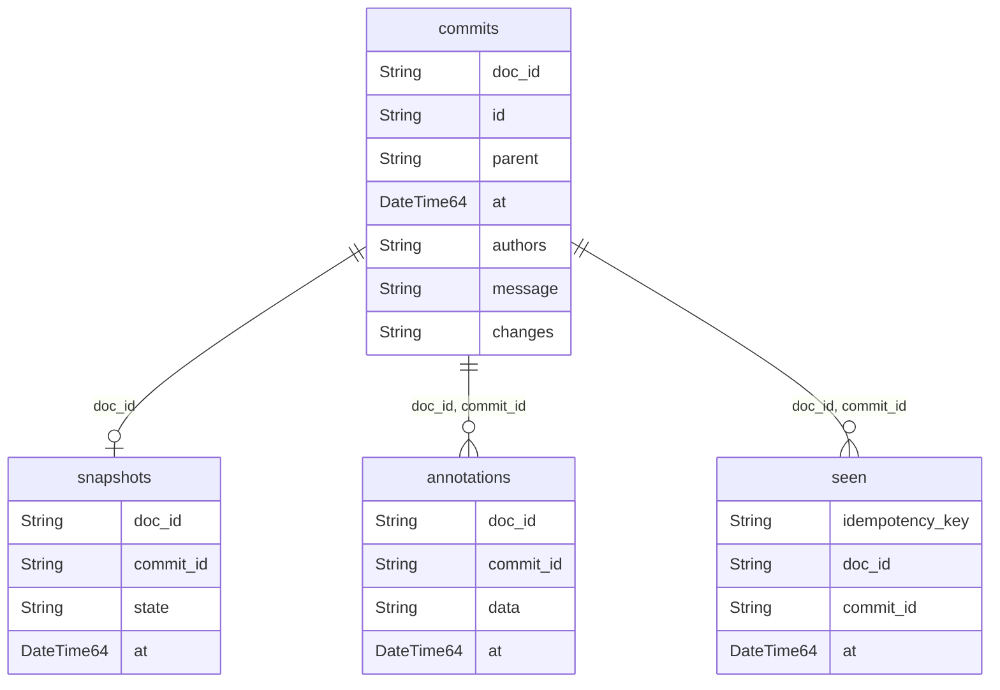

# adapters/clickhouse

Durable, columnar `changelog.Log` backend. The adapter creates 4 tables, all
`ReplacingMergeTree`, all DDL `IF NOT EXISTS` — created by `Migrate(ctx)` or
automatically via `Open(ctx, dsn, WithMigrate(true))`. Reads use `FINAL` to
force ClickHouse to collapse duplicate parts at query time rather than
waiting on a background merge (see [OPERATIONS.md](../../docs/operations.md)
for the `FINAL` cost in production).

## Schema

ClickHouse has no foreign key constraints — every relationship above is
application-enforced, all scoped by `doc_id`. No `PARTITION BY`, no `TTL` on
any table.

### `commits`

| Column | Type | Meaning |
|---|---|---|
| `doc_id` | `String` | the document this commit belongs to |
| `id` | `String` | the commit hash (`computeID`) |
| `parent` | `String` | the previous commit's id; `""` at the root |
| `at` | `DateTime64(6)` | when the commit was sealed |
| `authors` | `String` | JSON array of distinct actors |
| `message` | `String` | optional commit message |
| `changes` | `String` | JSON array of the sealed `Change`s |

`ENGINE = ReplacingMergeTree`, `ORDER BY (doc_id, at, id)`.

### `seen`

| Column | Type | Meaning |
|---|---|---|
| `idempotency_key` | `String` | producer-supplied dedup key |
| `doc_id` | `String` | the document the key is scoped to |
| `commit_id` | `String` | the commit that key sealed |
| `at` | `DateTime64(6)` | when the key was recorded |

`ENGINE = ReplacingMergeTree`, `ORDER BY (doc_id, idempotency_key)`.

### `snapshots`

| Column | Type | Meaning |
|---|---|---|
| `doc_id` | `String` | the document this snapshot is for |
| `commit_id` | `String` | the commit the snapshot was taken at |
| `state` | `String` | opaque snapshot bytes; core never interprets it |
| `at` | `DateTime64(6)` | version column — newest write wins |

`ENGINE = ReplacingMergeTree(at)`, `ORDER BY (doc_id)`.

### `annotations`

| Column | Type | Meaning |
|---|---|---|
| `doc_id` | `String` | the document this annotation is for |
| `commit_id` | `String` | the commit this annotation decorates |
| `data` | `String` | opaque annotation bytes; core never interprets it |
| `at` | `DateTime64(6)` | version column — newest write wins |

`ENGINE = ReplacingMergeTree(at)`, `ORDER BY (doc_id, commit_id)`.

## Non-obvious columns

- **`commits.id`** — content hash over `(parent, message, changes)` ONLY;
  `at` and `authors` sit outside the preimage. Each field is length-framed.
  core/commit.go:52-62.
- **`commits.parent`** — the previous commit's id, `""` at the root.
  core/recorder.go:110-118.
- **`commits.authors`** — derived sorted distinct actors from `changes`; NOT
  hashed. Recomputed and cross-checked by chain verification
  (`ErrAuthorsMismatch`). core/commit.go:73-85.
- **`seen.idempotency_key`** — retry dedup, scoped per `(doc_id, key)`; a
  hit short-circuits `Service.Seal`. core/service.go:108-133.
- **`snapshots.at` / `annotations.at`** — the `ReplacingMergeTree` version
  column, newest write wins. Both tables are non-authoritative (cache /
  display sidecar) — safe to truncate, the commit chain is unaffected.

## Table → Go struct

| Table | Struct | Scan site |
|---|---|---|
| `commits` | `changelog.Commit` (core/commit.go:35-42) | `scanCommit` (adapters/clickhouse/clickhouselog.go:133-148) |
| `commits` + `doc_id` | `changelog.DocCommit` (core/capability.go:19-22) | `scanDocCommit` (adapters/clickhouse/capability.go:253-268) |
| `snapshots` | `changelog.Snapshot` (core/capability.go:55-59) | `LoadSnapshot` (adapters/clickhouse/capability.go:189-203) |
| `annotations` | `changelog.Annotation` (core/capability.go:76-80) | `LoadAnnotations` (adapters/clickhouse/capability.go:223-251) |

`changelog` is the Go package name of module `github.com/zdirnecamlcs96/chronicle/core`.

`authors` and `changes` are JSON-encoded strings, unmarshalled on scan.

---

See [../sql/README.md](../sql/README.md) for the SQL adapter's schema.
