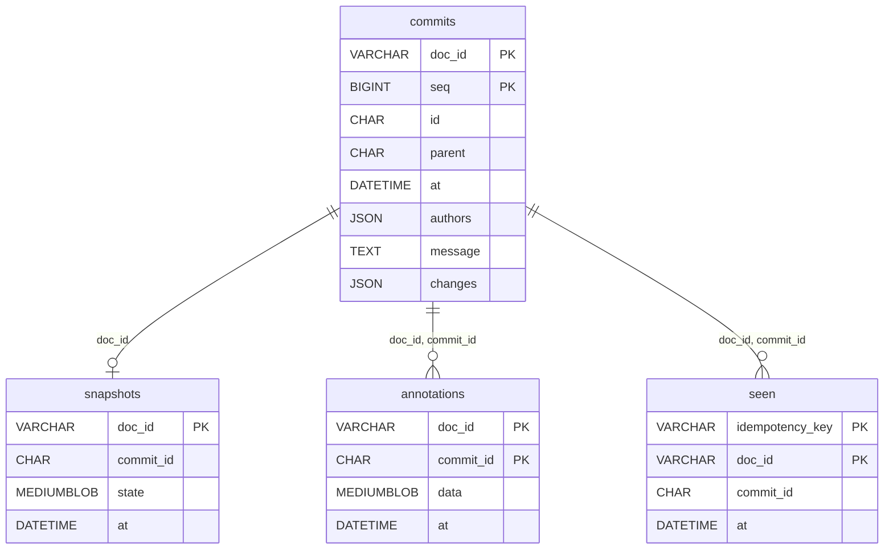

# adapters/sql schema

The SQL adapter stores a changelog in four tables: `commits`, `seen`,
`snapshots`, `annotations`. They are created by `Log.Migrate`
(`adapters/sql/schema.go:89-108`), which `Open` runs automatically when
called with `WithMigrate(true)` (`adapters/sql/sqllog.go:64-69`).

## Entity relationships

All relationships are scoped by `doc_id`; there is no foreign key on
`commit_id` alone (a `seen`/`annotations` row on one document never refers to
a commit on another).

(Mermaid `erDiagram` attribute types can't contain parentheses or spaces, so
the diagram above uses bare type names — see the tables below for exact SQL
types.)

## Columns

### commits

| Column | Type | Meaning |
|---|---|---|
| doc_id | VARCHAR(255) | document this commit belongs to |
| seq | BIGINT UNSIGNED | per-document sequence number; commit ordering |
| id | CHAR(64) | content hash of the commit (hex SHA-256) |
| parent | CHAR(64) DEFAULT '' | previous commit's id; `''` at the root |
| at | DATETIME(6) | when the commit was sealed |
| authors | JSON | sorted, distinct actors derived from `changes` |
| message | TEXT | optional commit annotation |
| changes | JSON | the sealed edits (the diff) |

- `PRIMARY KEY (doc_id, seq)`
- `UNIQUE KEY uq_commit_id (doc_id, id)`
- `KEY idx_doc_parent (doc_id, parent)`
- `KEY idx_id (id)`
- `KEY idx_at (at)`
- `KEY idx_doc_at (doc_id, at)`

### seen

| Column | Type | Meaning |
|---|---|---|
| idempotency_key | VARCHAR(255) | producer-supplied dedup key |
| doc_id | VARCHAR(255) | document the key is scoped to |
| commit_id | CHAR(64) | the commit that key sealed |
| at | DATETIME(6) | when the key was recorded |

- `PRIMARY KEY (doc_id, idempotency_key)`

### snapshots

| Column | Type | Meaning |
|---|---|---|
| doc_id | VARCHAR(255) | document this snapshot materializes |
| commit_id | CHAR(64) | commit id the snapshot is as-of |
| state | MEDIUMBLOB | opaque materialized state (16 MB ceiling; core never interprets it) |
| at | DATETIME(6) | when the snapshot was written |

- `PRIMARY KEY (doc_id)` — one row per document, latest write wins.

### annotations

| Column | Type | Meaning |
|---|---|---|
| doc_id | VARCHAR(255) | document the annotation belongs to |
| commit_id | CHAR(64) | commit the annotation decorates |
| data | MEDIUMBLOB | opaque sidecar payload, outside the hash seal |
| at | DATETIME(6) | when the annotation was written |

- `PRIMARY KEY (doc_id, commit_id)` — one row per commit, latest write wins.

## Non-obvious columns

- **`commits.seq`** — per-document sequence number carrying commit ordering;
  the second component of the primary key.
- **`commits.id`** — a content hash over `(parent, message, changes)` only;
  `at` and `authors` are outside the hash preimage
  (`core/commit.go:52-62`).
- **`commits.parent`** — the previous commit's id, `''` at the root
  (`core/recorder.go:110-118`).
- **`commits.authors`** — derived, sorted, distinct actors from `changes`;
  NOT hashed, and recomputed and cross-checked by chain verification
  (`core/commit.go:73-85`, `ErrAuthorsMismatch`, `core/verify.go:18-21`).
- **`seen.idempotency_key`** — retry dedup scoped per `(doc_id, key)`; a hit
  short-circuits `Service.Seal` (`core/service.go:108-133`).
- **`snapshots` / `annotations`** — non-authoritative (read cache / display
  sidecar); safe to truncate, the commit chain is unaffected.

## Dialect

`Dialect` (`adapters/sql/schema.go:8-16`) selects the DDL via `ddl()`
(`adapters/sql/schema.go:39-82`), which switches on the dialect — but only
MySQL is implemented, as the `default` branch of that switch. MySQL is the
tested target; the seam exists so Postgres or SQLite can be added later
without touching `Log`'s query logic. There is currently no Postgres or
SQLite support.

## Migration footgun

`WithMigrate` (`adapters/sql/sqllog.go:35`) is honored by `Open`
(`adapters/sql/sqllog.go:50-71`) but **ignored by `New`**
(`adapters/sql/sqllog.go:40-46`) when wrapping an existing `*sql.DB` — the
option is parsed into the config struct, but `New` never calls `Migrate`. A
caller that constructs a `Log` with `New` against a pool that hasn't been
migrated must call `Log.Migrate(ctx)` (`adapters/sql/schema.go:89-108`)
itself, or the four tables above won't exist.

## Table → Go struct

| Table | Go type | Scanned by |
|---|---|---|
| commits | `changelog.Commit` | `scanCommit` (`adapters/sql/sqllog.go:201-216`) |
| commits (cross-document, +doc_id) | `changelog.DocCommit` | `scanDocCommit` (`adapters/sql/capability.go:284-299`) |
| snapshots | `changelog.Snapshot` | `LoadSnapshot` (`adapters/sql/capability.go:181-195`) |
| annotations | `changelog.Annotation` (write) / `map[string][]byte` (read) | `SaveAnnotation` (`adapters/sql/capability.go:200-215`), `LoadAnnotations` (`adapters/sql/capability.go:219-248`) |

`changelog` is the Go package name of module `github.com/zdirnecamlcs96/chronicle/core`.

## SQL vs ClickHouse

| | adapters/sql | adapters/clickhouse |
|---|---|---|
| `seq` column | present — orders commits, backs the primary key | absent |
| Consistency | `PRIMARY KEY` / `UNIQUE` / index constraints, enforced on write | none — `ReplacingMergeTree` + `FINAL` dedup on read |
| Reads | strongly consistent | eventually consistent until merge/`FINAL` |
| `authors` / `changes` / `state` / `data` | `JSON` / `MEDIUMBLOB` columns | `String` columns |

See [`../clickhouse/README.md`](../clickhouse/README.md).
