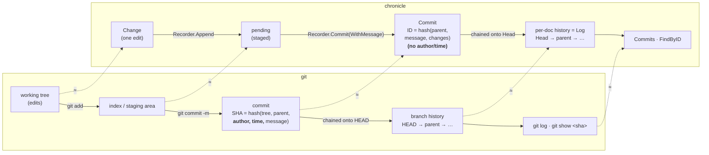

# The git mental model

`chronicle` is intentionally git-shaped: you **stage** edits, **seal**
them into an immutable, **content-addressed** commit **hash-chained** to its
parent, and each document keeps its own commit history like a **branch**. If you
know git, you already know the model.



## Two pieces: porcelain vs repository

Two types do the real work; the other two are the data they move.

- **`Recorder` = the porcelain** (git's `add` / `status` / `commit`), bound to
  **one document**. It *writes*: stage with `Append`, inspect with `Pending`, seal
  with `Commit`.
- **`Log` = the repository** — where commits live, **across documents**. It
  *stores*: `Head` is a document's branch tip, `Commits` is its `git log`.
- **`Change`** is a diff line; **`Commit`** is a commit object — the data the
  Recorder moves into the Log.

Two things git users reach for that **don't** exist here:

- **No `init`.** A document's history simply begins at its first commit
  (`parent == ""`, the root).
- **No working tree / index file.** The Recorder's in-memory staged buffer *is*
  the index, until you `Commit`.

## Mapping

| git | chronicle |
|---|---|
| working tree edit | `Change` (one line of a commit's diff) |
| `git add` → index | `Recorder.Append` → pending |
| `git status` | `Recorder.Pending` |
| `git commit -m` | `Recorder.Commit(WithMessage)` |
| commit SHA | `Commit.ID` (`computeID`) |
| HEAD / branch | `Head` / per-document `Log` |
| non-fast-forward push reject | `ErrParentConflict` |
| `git log` | `Commits` / `Indexer.AllCommits` |
| `git show <sha>` | `Indexer.FindByID` |

## The one deliberate divergence

git's commit SHA folds **author + time** into the hash, so every commit is
unique. The changelog **deliberately leaves them out**:

```
Commit.ID = SHA-256( parent + message + canonicalJSON(changes) )   // not At, not Authors
```

So the same logical change — sealed by a different producer, or at a different
time — yields the **same ID**. That content-addressing is what lets an
at-least-once delivery **dedup to a single commit** (`Deduper`): a retry carrying
a key already seen returns the original commit instead of sealing a duplicate.
