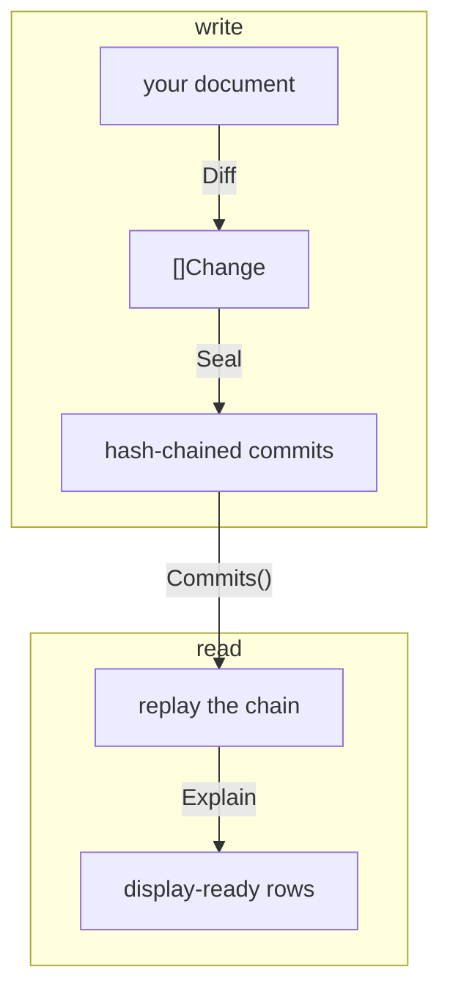






`core` deliberately knows nothing about documents, paths, or comparison. It
stores changes and hash-chains them. Everything that turns a document into
changes and back again lives under `kit/`, which imports only `core` plus the
standard library.

The kit is five packages, plus the optional `kit/httpapi` transport at the end
of this page. `chroniclekit` (in `kit/`) is the facade this page uses;
underneath it, `chronicleschema` holds the vocabulary you declare your
document's shape with, and `chroniclediff`, `chronicleview`, and
`chronicleexplain` are the three sides of the flow below. Each of the three is
independent of the others, so you can take one without the rest — the path
grammar and JSON handling they share lives in an internal package, out of your
way.

Every snippet below is taken from `Example_explain` in
[`kit/example_test.go`]({{ src }}/kit/example_test.go) — a runnable example whose
output `go test` checks, so nothing on this page can drift from the code. One
adaptation: the example wires up `memlog`, the kit's internal in-memory test
backend, since it has no adapter to import; this page swaps that line for
`New(yourLog)` against a real one.

## The shape of the flow



Write and read are given the **same** `[]chronicleschema.Option`. That is the
whole point of the vocabulary: declare your document's schema once, hand it to
both sides. It lives in its own package for exactly that reason — neither side
owns it.

## Where changes come from

The kit takes either two document states or a ready-made list of changes. It
does not care what produced them, and two shapes are worth spelling out.

**A CRUD handler** is the obvious one: load the record, apply the request, hand
both versions over. One person, one edit, one commit.

```go
k.RecordUpdate(ctx, docID, before, after, chroniclekit.WithActor(userID))
```

**A collaboratively edited document** is the other — the Google Docs shape,
where several people edit at once and the last write to a field wins.

**chronicle implements none of that.** Deciding the order is the CRDT layer's
job, and this library is not going to grow into that domain. What it does is
keep the audit chain afterwards, and the reason it fits is a property of the
data model rather than a feature:

> `Commit.Changes` is an **ordered list of operations**, not a snapshot of the
> result.

Replay it and you get the converged document, because the last write is
replayed last. Read it and every actor's operation is still there — including
the ones that lost, which the converged document no longer shows anywhere.
That is what makes the record worth auditing: "the budget is 1800" is one fact,
"bob set 1500 and dave overrode it" is the one an investigation needs.

```go
ops := []changelog.Change{
    {Path: "budget", Kind: KindPut, From: "1000", To: "1500", Actor: "bob"},
    {Path: "title",  Kind: KindPut, From: `"Q3 plan"`, To: `"Q3 plan (final)"`, Actor: "carol"},
    {Path: "budget", Kind: KindPut, From: "1500", To: "1800", Actor: "dave"},
}
commit, _ := k.RecordChanges(ctx, "doc-9", ops, WithMessage("collaborative edit"))
state, _ := k.State(ctx, "doc-9")
```

```
converged: map[budget:1800 title:Q3 plan (final)]
authors:   [bob carol dave]
  bob    budget  1000 -> 1500
  carol  title   "Q3 plan" -> "Q3 plan (final)"
  dave   budget  1500 -> 1800
```

Two writes to `budget` in one commit; the replay settles on dave's, and bob's
is still on the record. This is why `RecordChanges` sits beside `RecordUpdate`,
and why `Actor` lives on each `Change` rather than on the commit — `WithActor`
stamps one actor for a whole call, and a collaborative edit has several. Output
above is `Example_collaborativeEdit` in
[`kit/example_crdt_test.go`]({{ src }}/kit/example_crdt_test.go), checked by
`go test` like everything else on this page.

Note that diffing two *converged* states would not do this: a diff sees only
1000 → 1800 and bob disappears. Record the operations, not the net effect.

One thing to know either way: chronicle does not merge, rebase, or reject a
concurrent append. Two commits landing on the same parent are recorded as a
**fork** — both stay, `Verify`/`VerifyChain` treat it as legitimate ancestry
rather than corruption, and the tamper-evidence story survives it because
every commit's `Parent` is still inside its own hash. Replay still resolves
the state last-write-wins, by arrival order. If collaborators edit arrays,
declare element identity below, or concurrent positional edits will record
against whatever happened to sit at that index.

Other producers work the same way: a message consumer, a reconciliation job, an
importer. Anything that can name what changed.

## 1. Declare the schema

```go
opts := []chronicleschema.Option{
    // Write-side: how array elements are identified. "lines" is keyed by a
    // dot-path into the embedded entity; other arrays fall back to "_id".
    chronicleschema.WithArrayKeys(map[string]string{"lines": "product._id"}),
    chronicleschema.WithIdentityFields("_id"),
    // Read-side: how things are named, labelled, and folded.
    chronicleschema.WithNameFields("name"),
    chronicleschema.WithIgnoredFields("meta.rev"),
    chronicleschema.WithNames(map[string]string{"t1": "Fragile"}), // entity lives elsewhere
}
```

The options split into two groups, and the split matters more than it looks:

| | Write side (`Diff`, `RecordUpdate`) | Read side (`Explain`, `State`) |
|---|---|---|
| Options | `WithArrayKeys`, `WithIdentityFields`, `WithStrictIdentity`, `WithValueTypes` | the first two, plus `WithLabels`, `WithNameFields`, `WithNames`, `WithIgnoredFields` |
| Output | `[]Change`, **hash-sealed** into a commit | rows and value trees, **stored nowhere** |
| Getting it wrong | permanent — the changes are the hash preimage, and no later option re-keys history | free — change the option, all existing history re-renders |

**Identity is the one declaration you cannot take back.** It decides whether an
array edit records as `lines.0.qty: 1 → 3` against a stable element, or as a
positional rewrite of every field after an insert. The kit ships **no default**
— it knows no field names, so an array with neither a `WithArrayKeys` entry nor
a usable `WithIdentityFields` field pairs positionally. Declare it before the
first write and keep it stable.

Because that mistake is silent, add `WithStrictIdentity()` and an object array
with no usable identity fails the write with `chroniclediff.ErrNoIdentity`
instead of quietly pairing by index.

Everything else only decorates at read time. Rename a label, add a name field,
fold a new bookkeeping field — all of history re-renders, and not a stored byte
moves.

## 2. Record

`RecordUpdate` diffs `before → after` and seals the result in one call.

```go
v1 := map[string]any{
    "status": "open",
    "meta":   map[string]any{"rev": 1},
    "lines": []any{
        map[string]any{"product": map[string]any{"_id": "P1", "name": "NP1"}, "qty": 1},
    },
}
v2 := map[string]any{
    "status": "open",
    "meta":   map[string]any{"rev": 2},
    "lines": []any{
        map[string]any{"product": map[string]any{"_id": "P1", "name": "NP1"}, "qty": 3},
        map[string]any{
            "product": map[string]any{"_id": "P2", "name": "NP2"},
            "qty":     2,
            "tagIds":  []any{"t1", "t9"},
        },
    },
}

k := New(yourLog)
k.RecordUpdate(ctx, "order-7", nil, v1, WithActor("alice"), WithDiffOptions(opts...))
k.RecordUpdate(ctx, "order-7", v1, v2, WithActor("bob"), WithDiffOptions(opts...))
```

Note the document shape: each line **embeds** the entity it refers to rather
than carrying its fields inline, and `tagIds` holds ids of entities that live
outside this document entirely. Both are ordinary CRUD shapes, and both are
handled below without storing anything extra.

The stored record stays machine-shaped — dotted paths, canonical-JSON scalars:

```
put    lines.0.qty   1 → 3
create lines.1       ∅ → {"product":{"_id":"P2",…},"qty":2,"tagIds":["t1","t9"]}
put    meta.rev      1 → 2
```

Display metadata is never stored alongside it — [design
decisions]({{ u_design }}#write-side-options-are-permanent-read-side-ones-are-free)
has the reasoning. One stored change, two audiences:

<div class="ledger" aria-label="The same stored change rendered for two audiences">
  <div class="caption">one stored change — two audiences</div>
  <div class="entry">
    <div class="row1"><span class="msg">what the changelog stores</span><span class="tag">machine</span></div>
    <div class="diff"><span class="path">items.0.quantities.0.qty</span>: "12" → <span class="to">"14"</span> · put · alice</div>
  </div>
  <div class="entry head">
    <div class="row1"><span class="msg">what Explain derives</span><span class="tag sealed">read-time</span></div>
    <div class="diff">Items › Quantities › Kilogram <span class="path">(kg)</span> › Qty: 12 → <span class="to">14</span></div>
    <div class="parent">Element {Trail [Items, Quantities] · Name "Kilogram" · ID "kg"} · Field [Qty]</div>
  </div>
</div>

The kit emits structure — slices, names, canonical scalars, flags — never
formatting. Separators, truncation, verbs, colors, and folding belong to your
renderer: a CLI, a web app, and an email digest can all draw the same rows their
own way.

## 3. Read the chain

`Commits` is newest-first, like `git log`. `Explain` replays from the root, so
reverse before handing it over.

```go
commits, err := k.Service().Commits(ctx, "order-7", 0)
slices.Reverse(commits)
rows, err := chronicleexplain.Explain(commits, opts...)
// rows[i][j] decorates commits[i].Changes[j], 1:1
```

`Explain` replays the chain and derives display metadata from the revisions
surrounding each commit. Because it is all derived, records written long before
any schema was declared decorate exactly like new ones.

## 4. Render

Each `Explained` embeds the stored `Change` untouched and adds:

| Field | What it is |
|---|---|
| `Field []string` | label trail of the changed field, element-relative when `Element` is set |
| `Element` | the keyed array element the change sits in (`Trail`, `Name`, `ID`); `Element` with an empty `Field` is a whole-element add/remove |
| `Display` | id-valued `From`/`To` resolved to names |
| `Bookkeeping` | the change touches a `WithIgnoredFields` entry — still recorded, foldable on display |
| `FromValue`/`ToValue` | a container value decomposed as a `ValueNode` tree |

```go
for _, r := range rows[1] { // the update commit
    where := strings.Join(r.Field, " > ")
    if r.Element != nil {
        where = strings.Join(append(r.Element.Trail, r.Element.Name), " > ") + " | " + where
    }
    fmt.Printf("%s: %s -> %s", where, blank(r.From), blank(r.To))
    if r.Display != nil {
        fmt.Printf(" (%s -> %s)", blank(r.Display.From), blank(r.Display.To))
    }
    if r.Bookkeeping {
        fmt.Print(" [bookkeeping]")
    }
    fmt.Println()
    printTree(r.ToValue, "    ")
}
```

which prints:

```
Lines > NP1 | Qty: 1 -> 3
Lines > NP2 | : ∅ -> {"product":{"_id":"P2","name":"NP2"},"qty":2,"tagIds":["t1","t9"]}
    NP2
      Product
        Id = "P2" (NP2)
        Name = "NP2"
      Qty = 2
      Tag Ids
        0 = "t1" (Fragile)
        1 = "t9"
Meta > Rev: 1 -> 2 [bookkeeping]
```

Four things happened there, none of which required storing anything:

- **`Lines > NP1`** — the element is keyed by `product._id`, a dot-path. The
  element root has no name of its own, so the display name comes from the
  object the path descends into: `product.name`. The same rule names the value
  tree's root (`NP2`).
- **`Tag Ids › 0 = "t1" (Fragile)`** — `t1` names an entity that is not in this
  document at all. `WithNames` supplied it. `Value` is still the stored
  canonical scalar; `Display` is additive, so a UI can show the name and keep
  the id for a tooltip.
- **`Id = "P2" (NP2)`** — ids found *inside* the document resolve too, with no
  dictionary entry needed. Pairs discovered in the replayed revisions always
  beat a caller-supplied name, so a stale dictionary can never override the
  record.
- **`[bookkeeping]`** — `meta.rev` was recorded in full and flagged, not
  dropped. Folding it is the display's choice.

## What the kit will not do

The boundary is deliberate: **the kit emits structure, never formatting.**
Slices, not joined strings. Names, not sentences. Canonical scalars, not
prettified text. Flags, not decisions.

Separators, truncation, pluralization, verbs, colors, and folding belong to the
consumer — which is why a CLI, a web app, and an email digest can render the
same rows differently, and why the library never limits the styling.

## Over a wire

The option vocabulary is data, not callbacks — `WithNames` in particular is a
map precisely so a schema declared in one process survives serialisation to
another. Running `Explain` server-side keeps browser clients free of schema
logic, and the server stays schema-blind too — the vocabulary travels in the
request.

[`kit/httpapi`]({{ src }}/kit/httpapi) serves exactly that route:

```
POST /explain {"doc":"order-7","limit":10,"options":{
  "array_keys":{"lines":"product._id"}, "identity_fields":["_id"],
  "name_fields":["name"], "ignored_fields":["meta.rev"],
  "names":{"t1":"Fragile"}}}
```

The write side travels the same way. `POST /commits` takes a `schema` object
carrying the write half of the vocabulary — `array_keys`, `identity_fields`,
`strict_identity` — for the same reason: the producer knows its document's
shape, the server does not, and the declaration has to arrive with the write
that depends on it.

Two things about it are contract rather than convenience. **`limit` trims the
response, never the replay** — decoration is derived by replaying from the
root, so a truncated history would yield wrong labels, names, and element
identity. And **`WithLabels` has no wire form**: it takes a resolver function,
which never crosses a process boundary. That costs less than it sounds, because
every row still carries the stored `Change` untouched — including `path`, the
raw dotted path. A client that wants its own i18n keys off the wire translates
from `path` and ignores the Title Case `field` fallback.

`POST /commits` also accepts `patch` — an RFC 6902 operation list, applied to
the stored document and diffed rather than sealed directly. If your clients
speak JSON Patch, read [sealing RFC 6902 patches]({{ u_patches }}) before you
mount it; if they do not, ignore the field and nothing changes.

A non-empty `actor` field feeds `WithActor`, filling the blank `Change.Actor`
on every change the write produces — the same call above, over HTTP, one
field instead of a `RecordOption`. Two read-only routes round out the
surface: `GET /state?doc=&at=` reconstructs a document at HEAD, or as of a
given commit, and `GET /verify?doc=` runs `VerifyChain` over its history and
reports the result.

---

## Where to go next

- [Reference]({{ u_reference }}) — the exact contract of every call above
- [Design decisions]({{ u_design }}) — why the vocabulary splits the way it
  does, why display data is never stored, why there are three write methods
- [Sealing RFC 6902 patches]({{ u_patches }}) — only if a client sends you one
