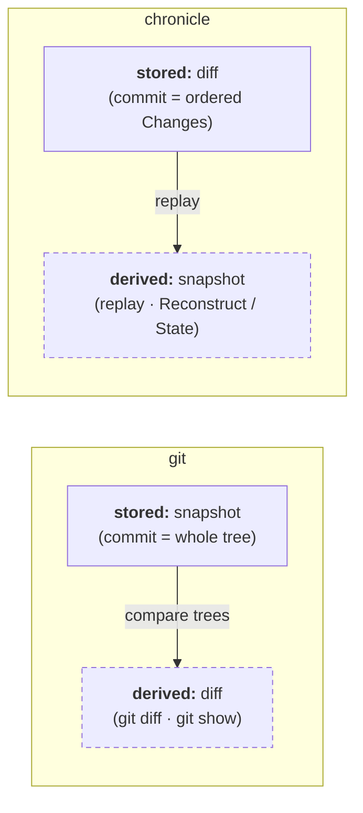

One inversion sits under the whole mapping, and the rest of the docs assume it:
**git stores snapshots and derives diffs; chronicle stores diffs and derives
snapshots.** A git commit holds a tree; a chronicle commit holds an ordered list
of operations, and state is what you get by replaying them.



Solid boxes are what each system persists; dashed boxes are computed on
demand. The call-by-call correspondence lives in the [mapping table](#mapping)
below — the diagram's only job is this reversal.

## Two pieces: porcelain vs repository

Two types do the real work; the other two are the data they move.

- **`Recorder` = the porcelain** (git's `add` / `status` / `commit`), bound to
  **one document**. It *writes*: stage with `Append`, inspect with `Pending`, seal
  with `Commit`.
- **`Log` = the repository** — where commits live, **across documents**. It
  *stores*: `Head` is a document's branch tip, `Commits` is its `git log`.
- **`Change`** is a diff line; **`Commit`** is a commit object — the data the
  Recorder moves into the Log.

Two things git users reach for that **don't** exist here:

- **No `init`.** A document's history simply begins at its first commit
  (`parent == ""`, the root).
- **No working tree / index file.** The Recorder's in-memory staged buffer *is*
  the index, until you `Commit`.

## Mapping

| git | chronicle |
|---|---|
| working tree edit | `Change` (one line of a commit's diff) |
| `git add` → index | `Recorder.Append` → pending |
| `git status` | `Recorder.Pending` |
| `git commit -m` | `Recorder.Commit(WithMessage)` |
| commit SHA | `Commit.ID` (`computeID`) |
| HEAD / branch | `Head` / per-document `Log` |
| non-fast-forward push (git rejects it) | recorded as a fork — both commits land, no rejection |
| `git log` | `Commits` / `Indexer.AllCommits` |
| `git show <sha>` | `Indexer.FindByID` |

## The one deliberate divergence

git's commit SHA folds **author + time** into the hash, so every commit is
unique. The changelog **deliberately leaves the commit's own metadata out**:

```
Commit.ID = SHA-256( parent + message + canonicalJSON(changes) )   // not Commit.At, not Authors
```

The ID names the content: equal `(parent, message, changes)` always yield the
same ID, and `At`/`Authors` are stored metadata that can never perturb the
chain (`Authors` is derived from the changes and cross-checked by
`VerifyChain`). One caveat keeps the claim honest: each `Change` carries its
own `At`, stamped by `Recorder.Append` at staging time and hashed as part of
the payload — so re-staging the same logical edit later still produces a
different ID. Dedup of at-least-once delivery is therefore the job of
**idempotency keys** (`Deduper`): a retry carrying a key already seen returns
the original commit instead of sealing a duplicate.
