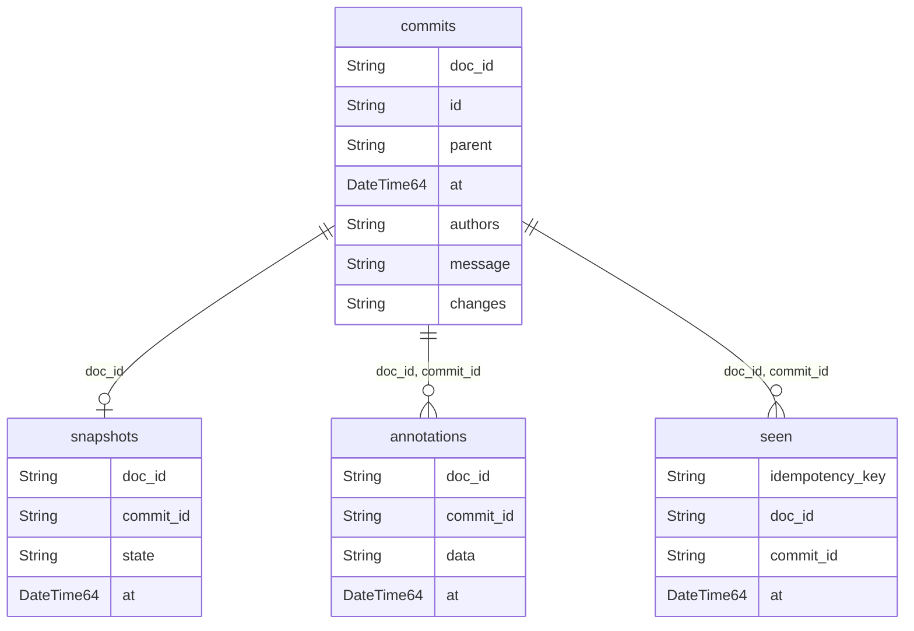

## Storage schema

Both `adapters/sql` and `adapters/clickhouse` create the same 4 tables —
`commits`, `seen`, `snapshots`, `annotations` — the same logical model on
different storage engines.



Only `commits` is authoritative. The other three are derived — each one buys
back something you would otherwise pay for at read time, and each can be
rebuilt or dropped without losing history.

| Table | What it is for | Safe to truncate? |
|---|---|---|
| `commits` | The log itself: append-only, hash-chained, one row per sealed commit | **No** — this is the data |
| `seen` | Idempotency — maps a delivery key to the commit it already produced | Yes, prunable by age |
| `snapshots` | Read cache — materialized state pinned to a commit, so reads skip replaying from root | Yes, replay rebuilds it |
| `annotations` | Display sidecar — readable rows frozen at seal time, stored outside the hash | Yes, reads fall back to live decoration |

`commits.id` is a content hash over `(parent, message, changes)`, and `parent`
points at the previous commit — that chain is what makes tampering detectable.
`authors` is derived from `changes` and deliberately sits outside the hash, so
it stays queryable without widening what the seal covers. The same reasoning
keeps `annotations` outside the preimage: a display concern must never change
what a commit hashes to.

Lose `seen`, `snapshots` and `annotations` and you lose idempotency, read speed
and readable history — not history itself.

Neither engine enforces these relationships with a foreign key — every one is
application-enforced, scoped by `doc_id`. Per-engine differences:

| | SQL (MySQL) | ClickHouse |
|---|---|---|
| `seq` column | present — orders commits, backs the primary key | absent |
| Consistency | `PRIMARY KEY` / `UNIQUE` / index constraints, enforced on write | none — `ReplacingMergeTree` + `FINAL` dedup on read |
| `authors` / `changes` / `state` / `data` types | `JSON` / `MEDIUMBLOB` | `String` |

Full column-by-column reference: [adapters/sql/README.md](https://github.com/zdirnecamlcs96/chronicle/blob/main/adapters/sql/README.md), [adapters/clickhouse/README.md](https://github.com/zdirnecamlcs96/chronicle/blob/main/adapters/clickhouse/README.md).

## Pick a backend by consistency model

| | `adapters/sql` (MySQL) | `adapters/clickhouse` |
|---|---|---|
| Consistency | **Synchronous** | **Eventual** |
| Seq assignment | serialized per document via `SELECT … FOR UPDATE` on the head row | none — no locks or transactions |
| Dedup of a re-sent commit | immediate (`UNIQUE(doc_id, id)` / `seen` table) | at read time via `ReplacingMergeTree` + `FINAL` (until a merge runs, duplicates are visible) |
| Concurrent same-document appends | may fork — `RunLogConformance`'s `ForkAppend` passes | may fork — `RunLogConformance`'s `ForkAppend` passes |
| Best for | source-of-truth audit log, concurrent writers per document | high-volume append, analytical queries |

Both backends record a fork — two writers landing on the same parent — as
legal history; neither serializes writers into one linear chain. Reconciling
concurrent writers (optimistic-concurrency retry keyed off `WithSealParent`/
`StateWithHead`, or an ACID transaction upstream) is the producer's job, never
this library's. SQL additionally serializes seq assignment per document, so
arrival order is well-defined even under a fork; ClickHouse has no locks, so
ordering rests on `at` timestamps and producer clock skew can reorder arrival.

## SQL (MySQL) operations

Full table schema, columns and keys: [adapters/sql/README.md](https://github.com/zdirnecamlcs96/chronicle/blob/main/adapters/sql/README.md).

**DSN.** Must include `parseTime=true` (DATETIME scans into `time.Time`). Example:
`user:pass@tcp(host:3306)/db?parseTime=true`.

**Connection pool.** `AppendCommit` opens a transaction and holds
`SELECT … FOR UPDATE` on a document's head row for the duration of the insert.
That means concurrent appends **to the same document** queue behind the lock;
appends to **different** documents proceed in parallel. Size the pool for your
cross-document concurrency, and cap connection lifetime so the pool recycles:

```go
db, _ := sql.Open("mysql", dsn)
db.SetMaxOpenConns(n)             // ~ peak concurrent distinct-doc writers + read load
db.SetMaxIdleConns(n)
db.SetConnMaxLifetime(5 * time.Minute)
log := changelogsql.New(db)
if err := log.Migrate(ctx); err != nil {
	// handle error
}
```

A hot single document is a serialization point by design — spread load across
documents, or batch a document's changes into fewer, larger commits.

**Lock waits / deadlocks.** Under contention you may see lock-wait timeouts or a
deadlock error. `AppendCommit` retries seq assignment internally for the
empty-document race, but a slow lock-wait timeout surfaces as an ordinary SQL
error — the caller should retry the `Seal`/`AppendCommit` call itself, not
treat it as a conflict to reconcile. Surface it as a transient error, not a 5xx.

## ClickHouse operations

Full table schema, columns and keys: [adapters/clickhouse/README.md](https://github.com/zdirnecamlcs96/chronicle/blob/main/adapters/clickhouse/README.md).

**`FINAL` cost.** Every `Head`/`Commits` read uses `… FINAL`, which forces
ReplacingMergeTree dedup at query time. Cost grows with the number of unmerged
parts, so:

- Prefer **fewer, larger inserts** over many tiny ones (each insert is a part).
- Let background merges run; do not disable them.
- Reserve `OPTIMIZE TABLE commits FINAL` for maintenance windows — it rewrites
  parts and is expensive on large tables.

**Eventual dedup window.** A re-inserted identical commit (or `seen` key) is one
logical row only *after* a merge. Between insert and merge, a non-`FINAL` reader
would see duplicates — always read with `FINAL` (the adapter does).

## Pruning the `seen` table

Idempotency records (`seen`) have **no automatic TTL** — they grow until pruned.
Cron the adapter's `PruneSeen` with a retention **longer than your producer's
maximum redelivery window** (a pruned key makes a very late replay seal a
duplicate commit):

```go
// e.g. daily: drop keys older than 30 days
n, err := sqlLog.PruneSeen(ctx, time.Now().AddDate(0, 0, -30)) // MySQL: returns rows deleted
err = chLog.PruneSeen(ctx, time.Now().AddDate(0, 0, -30))      // ClickHouse: async lightweight delete, no count
```

On ClickHouse, a native `TTL` clause on the `seen` table is the alternative for
fresh installs; `PruneSeen` covers existing deployments.

`PruneSeen` touches only idempotency keys. Commits are never pruned — every
fork's parent stays resolvable and the verify family is unaffected by any
retention window.

## Snapshots (read cache)

The `snapshots` table (SQL and ClickHouse) is a **pure cache**: one row per
document — the kit's materialized state at some commit, refreshed lazily on
read. It is never the source of truth:

- `TRUNCATE snapshots` is always safe; the next read falls back to a full
  replay and re-primes the cache.
- Restores may ignore it entirely.
- MySQL caps a snapshot at `MEDIUMBLOB` (16 MB); documents whose materialized
  state exceeds that should not be snapshotted.

## Migrations

`Migrate(ctx)` runs `CREATE TABLE IF NOT EXISTS` and is **idempotent** — safe to
call on every boot (`WithMigrate(true)` does this in `Open`). There is **no schema
version table yet**: additive changes are safe, but a breaking change (renaming a
column, tightening a constraint) needs a hand-written migration applied out of
band before deploying the new binary. Track this if you depend on the schema.

One in-place swap is automated: 0.3.0's fork tolerance replaces the anti-fork
`UNIQUE(doc_id, parent)` with a plain index, and `Migrate()` detects and
performs it on existing MySQL deployments. The manual equivalent:

```sql
ALTER TABLE commits DROP INDEX uq_doc_parent, ADD INDEX idx_doc_parent (doc_id, parent);
```

## Backup & restore

The `commits` table is **append-only**, which makes backup simple:

- **MySQL** — `mysqldump` or a binlog-based PITR; the append-only shape means a
  restore-then-replay is straightforward and conflict-free.
- **ClickHouse** — `BACKUP TABLE commits TO …` (native) or part-level snapshots.

Restoring is safe to over-deliver: re-inserting already-present commits dedups
(SQL by unique constraint, ClickHouse by ReplacingMergeTree).

## Observability

The adapters currently expose no metrics/tracing hooks — they are a thin layer
over `database/sql`. Instrument at the `*sql.DB` (driver-level metrics: open/idle
conns, wait count/duration) and wrap the `changelog.Log` calls in your own
spans/counters at the call site until first-class hooks land.
