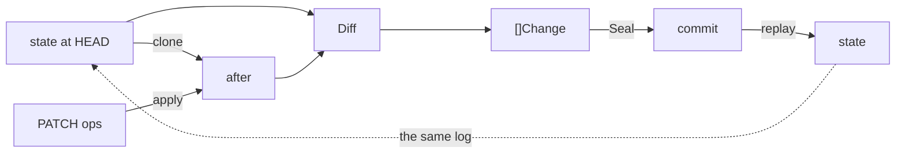





**Read this only if a client sends you JSON Patch.** Everything here is
optional: `core` does not know RFC 6902 exists, the kit's `RecordPatch` is one
of three write methods, and `kit/httpapi`'s `patch` field is one of three
request shapes. Omit all of it and nothing changes.

It gets its own page because a patch is the one input whose *correct* handling
is not obvious from the call site — seal it the direct way and you permanently
record commits with no before-values. [The kit page]({{ u_kit }}) is the flow
this hangs off; [reference]({{ u_reference }}) is the exact contract.

A client that speaks RFC 6902 sends operations, not documents. The changelog
stores neither — it stores changes with before-values. Bridging those two is
the longest path through the kit, so it is worth following end to end.

A patch is a **forward-only instruction**; a changelog entry is a
**bidirectional fact**. Converting one into the other needs a before-value the
patch does not carry, and there are only three places it can come from:

| write shape | where `From` comes from | what the log records |
|---|---|---|
| `RecordChanges` | the caller built the `Change`, `From` included | the caller's assertion, verbatim |
| `RecordUpdate` | the caller's `before` document, via `Diff` | the caller's assertion |
| `RecordPatch` | the library reads the state at HEAD and infers it | the library's reading — true relative to the commit it is anchored to |

The first two record what someone claimed; a stale claim is recorded
faithfully as that someone's stale claim. `RecordPatch` has no claim to record
— a patch carries none — so the commit's **parent** does the work: it names
the exact snapshot the `From` values were diffed against (step 5 reads it,
step 8 anchors to it). A concurrent writer can make that snapshot stop being
the tip, but never make the commit a lie.



The patch is an **input**, never a record. It is consumed before anything is
sealed and does not survive the request.

Take a document at HEAD:

```json
{"status": "draft", "lines": [{"id": "a", "qty": 1}, {"id": "b", "qty": 2}]}
```

and a client that wants line `a` deleted and the status opened:

```
POST /commits
{"doc_id": "order-7",
 "patch": [{"op": "remove",  "path": "/lines/0"},
           {"op": "replace", "path": "/status", "value": "open"}],
 "schema": {"identity_fields": ["id"]},
 "message": "close out line a"}
```

## 1. Decode

The body is capped at 4 MiB before a byte is parsed, then decoded into
`postRequest`. Malformed JSON, or a `value` that is not a legal JSON value,
fails here — `400`, nothing read, nothing written. `doc_id` is required.

## 2. Pick the write shape

`changes` → `patch` → `before`/`after`, first present wins. This body names only
`patch`, so it routes to `Kit.RecordPatch`.

## 3. Assemble options

`message` and `idempotency_key` become `RecordOption`s. `schema` becomes
`WithDiffOptions(WithIdentityFields("id"))` — it is forwarded to the `Diff` in
step 7, and reaches nothing else. Declaring it here is not decoration: identity
decides what gets *recorded*, and step 7 is the only moment it can be applied.

## 4. Pre-flight every op

Before the state is read, each op is checked twice: its `op` must be
`add`/`replace`/`remove`, and its `path` must not resolve to the document root.

`ToChanges` *skips* ops it does not understand, which is correct for reading a
patch and wrong for sealing one — a skipped `move` produces a `201` over a
commit that records an edit the client never sent. So `RecordPatch` refuses the
whole batch with `ErrUnsupportedOp`, mapped to `400`. Root-targeted ops are
refused for a structural reason: the kit's root path is `""`, and `Reconstruct`
does not apply an empty path, so such a change could be sealed but never
replayed.

The check runs first so a bad batch costs one pass over the ops and leaves the
log untouched.

## 5. Read the document at HEAD

`k.StateWithHead(ctx, docID)` reconstructs `before` from the log — snapshot-
and cursor-accelerated where the backend supports it, full replay where it does
not — and returns the ID of the commit that state was read at. That ID becomes
the sealed commit's parent in step 8: the log will record exactly which
snapshot this patch was applied to. This is the server's document, not the
client's idea of it. The patch's own indices are about to stop mattering.

## 6. Clone

`docmodel.Normalize(before)` marshals and unmarshals to produce `after`, a
structurally separate copy.

This is load-bearing, not hygiene. `Apply` mutates maps and slices in place.
Patch `before` directly and `after` is the same object, step 7 diffs the
document against itself, `Diff` returns nothing, and `Seal` answers
`ErrEmptyChanges` — a write that silently did nothing. `Normalize` is also the
exact normalization `Diff` would perform on both sides anyway, so the copy is
free.

## 7. Apply, then diff

Ops apply **in order**, each seeing the document as the previous one left it.
After `remove /lines/0`:

```json
{"status": "draft", "lines": [{"id": "b", "qty": 2}]}
```

Then `replace /status`. Now `Diff(before, after, WithIdentityFields("id"))`
runs, and three things happen that a patch alone could not express:

- **`From` appears.** `status` records `"draft" → "open"`. Applying a patch
  never needed to *read* the old value — it navigates to the slot and
  overwrites — so nothing upstream retained it. Diffing against the stored
  document recovers it. This is permanent either way: `Change.From` is inside
  the commit-hash preimage, so a blank cannot be backfilled later.
- **Identity replaces position.** `lines` pairs by `id`, so the delete records
  `From = {"id":"a","qty":1}` — *which element died*, not merely that index 0
  did. Without the declaration it would pair positionally and record index 0
  plus a shifted edit.
- **The kind is corrected.** RFC 6902 says `add` on a member that already
  exists replaces it, but `ToChanges` maps `add`→`create` unconditionally.
  Replay is unaffected (`Apply` treats the two identically), but `Explain`
  would announce a creation for an update. Diff reads the two documents and
  names the kind from what actually changed.

With `strict_identity` set and an object array the declared identity does not
cover, this step fails instead — `ErrNoIdentity`, `400`. It fires here because
here is the last moment the mistake is still fixable.

## 8. Seal

`RecordChanges` stamps a blank `Change.Actor` from `WithActor` (an explicit
per-change actor wins) — over HTTP, the request's `actor` field is what
supplies it — then `Service.Seal` anchors the changes to the head the state
was read at in step 5, computes the commit id as SHA-256 over parent, message,
and canonical changes, and appends. A concurrent writer on the same document
is not a conflict and is not retried over: it produces a *sibling* commit —
two commits sharing a parent, a recorded fork — and the read side folds both
in arrival order.

An empty diff — a patch that changed nothing, or a reorder under keyed
pairing — returns `ErrEmptyChanges`, which the handler answers `400`.

## 9. Respond

`201` and the sealed `Commit`, changes included. What the client gets back is
the *effect* of its patch, not its patch:

```
delete lines.0   {"id":"a","qty":1} → ∅
put    status    "draft" → "open"
```

`FromChanges` on those will not reproduce the ops that were sent, and is not
meant to. A reorder in records nothing; an `add` over an existing field records
a replace; a keyed delete carries the element's identity. You are storing what
happened, not what was requested. If the literal request matters for audit, it
is not in the log — put it in `message` or your access log.

## Where it can fail

| Stage | Failure | Status |
|---|---|---|
| 1 | malformed body, missing `doc_id` | `400` |
| 4 | `move`/`copy`/`test`, or an op targeting the root | `400` |
| 5 | backend read error | `500` |
| 7 | `strict_identity` and an array with no usable identity | `400` |
| 8 | nothing changed | `400` |
| 8 | a backend write error | `500` |

Every `400` above is decided **before** anything is appended. There is no
partial commit.

## What it does not give you

**Lost-update prevention.** State is read at step 5 and sealed at step 8, and
nothing blocks a writer landing in between — by design: OCC and ACID are the
persistence layer's job, and this library does not fake them one floor up.
What the log guarantees instead is honesty. The commit's parent is the head
the state was read at, so a concurrent writer produces a *sibling* commit — a
recorded fork, both facts preserved, folded last-write-wins in arrival order
at read time. `From` is true relative to the commit's recorded parent, never
silently rebased onto state the patch did not see. RFC 6902's own answer to
races is the `test` op, which this route rejects; a caller who wants real
optimistic concurrency should hold it where the document lives — which is the
next paragraph.

**If a document store already serializes your writes** — CouchDB's `_rev`, a
SQL row version, any compare-and-swap — apply the patch against that store and
record the outcome with `before`/`after` instead:

```text
doc, rev ← store.Get(docID)           // before + version marker
after    ← apply(doc, patch)
store.Put(docID, rev, after)          // conflict? re-read, re-apply, retry
kit.RecordUpdate(ctx, docID, doc, after)
```

A successful conditional write proves `doc` was current at the moment `after`
replaced it — the serialized read a changelog bolted on beside the store can
never manufacture. Capture `before` at write time; stores compact old
revisions, so it cannot be recovered later. `RecordPatch` is for producers
with no store to serialize against, and it records forks instead of pretending
they cannot happen. The [design page]({{ '/documentation/design/' | relative_url }}#the-guarantee-boundary-best-effort-now-guaranteed-later)
states the wider guarantee boundary — best-effort trail with tamper detection
today, durable change-stream capture as the upgrade path.

**RFC 6902 application semantics.** `Apply` is permissive where the RFC is
strict: it vivifies missing containers, grows arrays with nulls to reach an
index, and treats a `remove` of something absent as a no-op. That is the right
behaviour for *replaying a changelog*, which is what it was written for, and it
means a patch the RFC would reject can still be applied here. Validate patches
from untrusted producers before handing them over.

**Two replays per write.** Step 5 reconstructs the document and step 7 walks it
again. Fine for CRUD, and snapshot support covers the first; not a hot loop.
